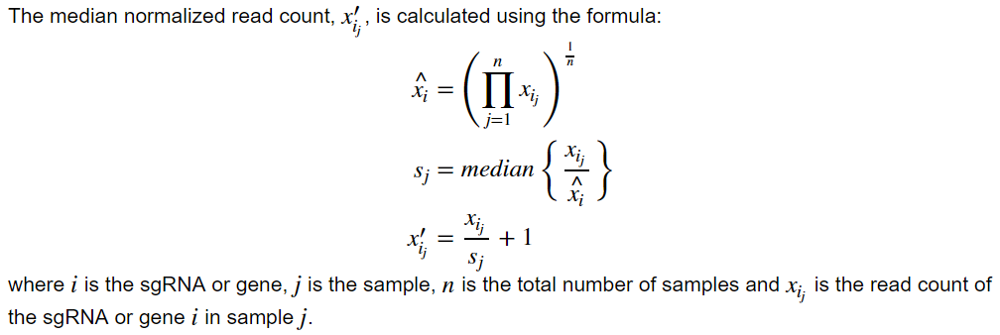

# data_processing

Custom python package to assist in data processing and database interactions.

# Dependencies 

* [Matplotlib](https://matplotlib.org/) - plotting library
* [Matplotlib-Venn](https://pypi.python.org/pypi/matplotlib-venn) - creates venn diagrams
* [MySQL.Connector](https://www.mysql.com/products/connector/) - connects to mySQL database
* [Pandas](http://pandas.pydata.org/) - dataframes 
* [Paramiko](http://www.paramiko.org/) - SSH connection
* [PyODBC](https://github.com/mkleehammer/pyodbc) - connects to MSSQL database
* [SciPy](https://www.scipy.org/) - scientific computing functions
* [SSHTunnel](https://pypi.python.org/pypi/sshtunnel) - SSH tunnel

# Files 

## Table of Contents

* [dna_functions.py](#dnafunctions)
* [edit_db.py](#editdb)
* [fold_change.py](#foldchange)
* [make_venn.py](#makevenn)
* [normalize.py](#normalize)
* [read_counting.py](#readcounting)
* [TrimAndAlign Class](#trimandalign)

## dna_functions.py 

Common functions for dealing with DNA and RNA sequences.

### Functions:
* rev_comp - reverse complements the passed in DNA or RNA sequence 
* transcribe - transcribes the passed in DNA sequence to RNA
* rev_trans - reverse transcribes the passed in RNA sequence to DNA 
* dna_to_rna - directly converts DNA to RNA by replacing T with U 
* rna_to_dna - directly converts RNA to DNA by replacing U with T

## edit_db.py 

Functions to connect to and edit a MSSQL or MySQL database. All of the specifications for 
the database connection should be included in a config.csv file. This file contains two 
columns: parameters and values. The parameters are:
* default_db [optional]: default database to connect to, could also pass db_name as
parameter of functions
* host_ip: IP address of the database
* host_user_name: user name on server
* mysql_user_name [optional]: MySQL user name
* db_prefix: if the database has a prefix, can add this, otherwise use empty string
* key_loc [optional]: location of the ssh key, if ssh tunneling is necessary to connect

### Functions:
* connect_db - creates a conncection to a MySQL or MSSQL database
  * sql_version: version of SQL of the database (ie MSSQL or MySQL)
  * db_name [optional]: name of the database to connect to. If MySQL, db_prefix will be added automatically; default: None
  * firewall [optional]: if behind a firewall, will use ssh tunneling to connect to database; default: False
  * key_loc [optional]: file location of the ssh key for accessing MySQL database; default: None
  * db_pwd [optional]: database user password; default: None
  * key_pwd [optional]: password for the ssh key; default: None
* close_db_connection - closes the connection to the database 
  * connection: database connection
  * server [optional]: server connection tunnel; default: None 
* excute_with_error_check - executes the passed in string with error checking
  * execute_str: SQL string to execute 
  * connection: connection to the database
  * cursor: database cursor 
  * sql_version: version of SQL of the database (ie MSSQL or MySQL)
* check_table_exists - checks if a table with the passed in name already exists in the database
  * table_name: table name to check if exists 
  * cursor: database cursor 
* make_table - Creates a new table with the passed in columns. Several checks are run to ensure database integrity
will not be unknowingly compromised (see flow chart)

  * table_name: name of the table to create 
  * columns_dict: dictionary of column names with a list of conditions (ie 'NOT NULL') and datatypes
  * other_conditions [optional]: a list of other conditions for the table, such as primary key and foreign keys
  * db_name [optional]: name of the database to connect to; default: None, will be replaced with config file default during connection
  * sql_version [optional]: version of SQL of the database (ie MSSQL or MySQL); default: MSSQL
  * firewall [optional]: if behind a firewall, will use ssh tunneling to connect to database; default: False
  * key_loc [optional]: file location of the ssh key for accessing MySQL database; default: None, will be replaced with config file default during connection
  * db_pwd [optional]: database user password; default: None
  * key_pwd [optional]: password for the ssh key; default: None 
* check_fk - checks if the table has a foreign key referencing it 
  * table: name of the table to check 
  * cursor: database cursor 
  * sql_version: version of SQL of the database (ie MSSQL or MySQL)
* delete_table - drops table from the database after checking for foreign key dependencies 
  * table: name of the table to drop 
  * connection: connection to the database
  * cursor: database cursor 
  * sql_version: version of SQL of the database (ie MSSQL or MySQL)
* clear_table - truncates the table. This function ignores foreign key constraints, so make sure to clear referencing table first!
  * table: name of the table to clear
  * db_name [optional]: name of the database to connect to; default: None, will be replaced with config file default during connection
  * sql_version [optional]: version of SQL of the database (ie MSSQL or MySQL); default: MSSQL
  * firewall [optional]: if behind a firewall, will use ssh tunneling to connect to database; default: False
  * key_loc [optional]: file location of the ssh key for accessing MySQL database; default: None, will be replaced with config file default during connection
  * db_pwd [optional]: database user password; default: None
  * key_pwd [optional]: password for the ssh key; default: None 
* add_column - adds a column to an existing table 
  * column_name: name of column to add 
  * column_type: type of the new column 
  * table: name of the table to add the column to 
  * db_name [optional]: name of the database to connect to; default: None, will be replaced with config file default during connection
  * sql_version [optional]: version of SQL of the database (ie MSSQL or MySQL); default: MSSQL
  * firewall [optional]: if behind a firewall, will use ssh tunneling to connect to database; default: False
  * key_loc [optional]: file location of the ssh key for accessing MySQL database; default: None, will be replaced with config file default during connection
  * db_pwd [optional]: database user password; default: None
  * key_pwd [optional]: password for the ssh key; default: None 
* make_row - creates a new row with the passed in data for the given table
  * insert_dict: dictionary of column name: value to insert
  * table: name of the table to add the row to 
  * db_name [optional]: name of the database to connect to; default: None, will be replaced with config file default during connection
  * sql_version [optional]: version of SQL of the database (ie MSSQL or MySQL); default: MSSQL
  * firewall [optional]: if behind a firewall, will use ssh tunneling to connect to database; default: False
  * key_loc [optional]: file location of the ssh key for accessing MySQL database; default: None, will be replaced with config file default during connection
  * db_pwd [optional]: database user password; default: None
  * key_pwd [optional]: password for the ssh key; default: None 
* make_many_rows - Instead of inserting a single row into the database, inserts up to 950 
in one statement, looping until all rows are inserted. Returns True if successful.
  * insert_dict: dictionary of column name: list of value to insert
  * table: name of the table to add the rows to 
  * db_name [optional]: name of the database to connect to; default: None, will be replaced with config file default during connection
  * sql_version [optional]: version of SQL of the database (ie MSSQL or MySQL); default: MSSQL
  * firewall [optional]: if behind a firewall, will use ssh tunneling to connect to database; default: False
  * key_loc [optional]: file location of the ssh key for accessing MySQL database; default: None, will be replaced with config file default during connection
  * db_pwd [optional]: database user password; default: None
  * key_pwd [optional]: password for the ssh key; default: None 
* update_row - Updates a row in the table 
  * update_dict: dictionary of column names and values to be updated
  * condition_dict: dictionary of column names and values to identify the row to be updated
  * table: name of table with row to be updated
  * db_name [optional]: name of the database to connect to; default: None, will be replaced with config file default during connection
  * sql_version [optional]: version of SQL of the database (ie MSSQL or MySQL); default: MSSQL
  * firewall [optional]: if behind a firewall, will use ssh tunneling to connect to database; default: False
  * key_loc [optional]: file location of the ssh key for accessing MySQL database; default: None, will be replaced with config file default during connection
  * db_pwd [optional]: database user password; default: None
  * key_pwd [optional]: password for the ssh key; default: None 
* update_many_rows - Updates multiple rows in the table 
  * update_dict: dictionary of column names and list of values to be updated
  * condition_dict: dictionary of column names and list of values to identify the rows to be updated
  * table: name of table with rows to be updated
  * db_name [optional]: name of the database to connect to; default: None, will be replaced with config file default during connection
  * sql_version [optional]: version of SQL of the database (ie MSSQL or MySQL); default: MSSQL
  * firewall [optional]: if behind a firewall, will use ssh tunneling to connect to database; default: False
  * key_loc [optional]: file location of the ssh key for accessing MySQL database; default: None, will be replaced with config file default during connection
  * db_pwd [optional]: database user password; default: None
  * key_pwd [optional]: password for the ssh key; default: None 
* format_value - formats the value for use in a SQL statement. Adds '' to strings and convertes python's None to NULL
  * value: value to format

## fold_change.py 

Calculates the fold change and the log2 fold change.

### Functions:
* log_fold_change - Calculates the log2 fold change between experimental column(s) and
the average of control columns and returns dataframe
  * df: pandas dataframe 
  * control_list: list of column names of control samples
  * experimental_col: column name or list of column names of experimental/treatment sample(s) 
* fold_change - Calculates the fold change between experimental column(s) and
the average of control columns and returns dataframe
  * df: pandas dataframe 
  * control_list: list of column names of control samples
  * experimental_col: column name or list of column names of experimental/treatment sample(s) 

## make_venn.py 

Creates venn diagrams.

### Function: 
* make_diagram
  * group_list: list of lists of values in the given group
  * name_list: list of names for each group
  * title: title for the venn diagram
  * output_file: name of file to save diagram to
  * return_names [optional]: returns the names/values in overlap of all groups; default False
  * figsize [optional]: size (in inches) of figure; default (8,6)
  * high_qual [optional]: returns a higher quality (800 dpi) figure; default False

## normalize.py 

The functions inside this file are divided by normalization method.

### Median Normalization

* med_norm - median normalizes a dataframe 
  * df: pandas dataframe of read counts

### RPM Normalization

* rpm_norm_df - read per million normalizes the dataframe
  * df: pandas dataframe of read counts

* rpm_norm_ser - reads per million normalizes the series
  * ser: pandas series of read counts

### RPKM Normalization

* rpkm_norm - read per kilobase per million normalizes the reads 
  * df: pandas dataframe of read counts 
  * gene_len_file: file with lenght of genes

* get_gene_len_gtf - adds together the exon lengths minus the overlap for each gene 
  * gtf_file: file with exon genomic locations in gtf format
  * out_file: file to output the lengths to 

### TMM Normalization

* tmm_norm - trimmed mean of M-values normalizes the reads. Was adapted from [EdgeR](https://bioconductor.org/packages/release/bioc/html/edgeR.html)'s 
[calcNormFactors](https://github.com/Bioconductor-mirror/edgeR/blob/release-3.5/R/calcNormFactors.R) function.
  * df: pandas dataframe of read counts 
  * ref_samp: reference sample column name 
  * trim_fc_perc [optional]: percentage of top and bottom fold change values to trim; default 30 
  * trim_abs_perc [optional]: percentage of top and bottom absolute expression values to trim; default 5

## read_counting.py 

Counts the reads which align to mature miRNAs or sgRNAs.

### functions:
* create_mir_dict - Creates a dictionary of chromosomes which hold a positive strand and negative strand dictionary
        which each hold a dictionary with genomic locations +/- 5 bp as keys and mature miRNA IDs of the miRNAs 
        which align to that location as values. This dictionary includes not only the genomic location of the mature
        miRNA, but also the genomic locations in hg38 which are identical to the mature miRNA. Also creates a dictionary 
        with every matID as keys and 0 as values to intialize counter object
* find_mir_match - Counts the reads which overlap with mature miRNAs. Returns the read counter and a QC counter. 
  * f_name: location of the sam file with the aligned reads 
  * chrom_dict: miRNA dictionary created by `create_mir_dict`
  * mat_ids: dictionary of all mature read counts with 0 key values to initialize read counter. Created by `create_mir_dict`.
* count_sgrna - Counts the reads which align to sgRNAs. Returns a pandas dataframe of read counts and a summary dataframe.
  * fnameList: list of sam files with aligned reads from amplicon sequencing
  * sampleNameList: list of sample names, one per file in the same order 
  * sgRNANameList: list of names of sgRNAs in the library

## TrimAndAlign class (trim_align.py)

This class allows for NGS reads to be trimmed and aligned on a server which runs [Btrim](https://doi.org/10.1016/j.ygeno.2011.05.009),
[Bowtie](http://bowtie-bio.sourceforge.net/index.shtml), [Bowtie2](http://bowtie-bio.sourceforge.net/bowtie2/index.shtml) and
[TopHat](https://ccb.jhu.edu/software/tophat/manual.shtml). Creation of a TrimAndAlign object results in a connection to the server and
creation of a log file. The connection and log file are closed when the object is deleted. 

### Functions:
* fileToServer: moves file to server
  * curLocation: current location of the file
  * fname: name of the file on the server 
  * ext [optional]: file extension on server; default ""
* fileFromServer: moves file from server
  * locLocation: local directory to transfer file to 
  * fname: name of the file to transfer
  * ext [optional]: file extension on server; default ""
* trim: trims the reads using [Btrim](https://doi.org/10.1016/j.ygeno.2011.05.009)
  * trimName: file with the sequences to be trimmed from the reads (details [here](http://graphics.med.yale.edu/trim/howto))
  * sampName: name of sample file to trim (<sampName>.fastq)
  * param [optional]: Btrim parameters to use (details [here](http://graphics.med.yale.edu/trim/readme)); default "-l 16"
* makeIndex: creates a [Bowtie2](http://bowtie-bio.sourceforge.net/bowtie2/index.shtml) index
* makeIndex_bowtie: creates a [Bowtie](http://bowtie-bio.sourceforge.net/index.shtml) index 
* align: aligns reads using [Bowtie2](http://bowtie-bio.sourceforge.net/bowtie2/index.shtml)
* align_bowtie: aligns reads using [Bowtie](http://bowtie-bio.sourceforge.net/index.shtml)
* align_tophat: aligns mRNA-seq reads using [TopHat](https://ccb.jhu.edu/software/tophat/manual.shtml)
* cleanUp: deletes all the files with sample name from the server