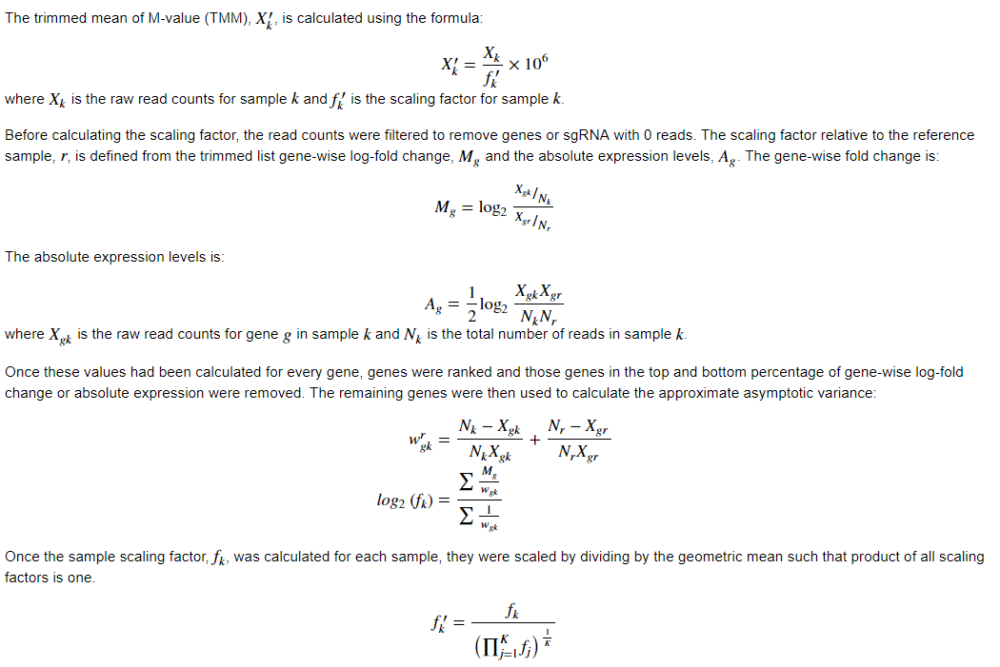

# data_processing

Custom python package to assist in data processing and database interactions.

# Dependencies 

* [Matplotlib](https://matplotlib.org/) - plotting library
* [Matplotlib-Venn](https://pypi.python.org/pypi/matplotlib-venn) - creates venn diagrams
* [Pandas](http://pandas.pydata.org/) - dataframes 
* [Paramiko](http://www.paramiko.org/) - SSH connection
* [SciPy](https://www.scipy.org/) - scientific computing functions

# Files 

## make_venn.py 

Creates venn diagrams.

### Function: 
* make_diagram
  * group_list: list of lists of values in the given group
  * name_list: list of names for each group
  * title: title for the venn diagram
  * output_file: name of file to save diagram to
  * return_names [optional]: returns the names/values in overlap of all groups; default False
  * figsize [optional]: size (in inches) of figure; default (8,6)
  * high_qual [optional]: returns a higher quality (800 dpi) figure; default False

## normalize.py 

### Functions
* med_norm - median normalizes a dataframe 
  * df: pandas dataframe of read counts

* rpm_norm_df - read per million normalizes the dataframe
  * df: pandas dataframe of read counts

* rpm_norm_ser - reads per million normalizes the series
  * ser: pandas series of read counts

* rpkm_norm - read per kilobase per million normalizes the reads 
  * df: pandas dataframe of read counts 
  * gene_len_file: file with lenght of genes

* get_gene_len_gtf - adds together the exon lengths minus the overlap for each gene 
  * gtf_file: file with exon genomic locations in gtf format
  * out_file: file to output the lengths to 

* tmm_norm - trimmed mean of M-values normalizes the reads. Was adapted from [EdgeR](https://bioconductor.org/packages/release/bioc/html/edgeR.html)'s 
[calcNormFactors](https://github.com/Bioconductor-mirror/edgeR/blob/release-3.5/R/calcNormFactors.R) function.
  * df: pandas dataframe of read counts 
  * ref_samp: reference sample column name 
  * trim_fc_perc [optional]: percentage of top and bottom fold change values to trim; default 30 
  * trim_abs_perc [optional]: percentage of top and bottom absolute expression values to trim; default 5

## TrimAndAlign class (trim_align.py)

This class allows for NGS reads to be trimmed and aligned on a server which runs [Btrim](https://doi.org/10.1016/j.ygeno.2011.05.009),
[Bowtie](http://bowtie-bio.sourceforge.net/index.shtml), [Bowtie2](http://bowtie-bio.sourceforge.net/bowtie2/index.shtml) and
[TopHat](https://ccb.jhu.edu/software/tophat/manual.shtml). Creation of a TrimAndAlign object results in a connection to the server and
creation of a log file. The connection and log file are closed when the object is deleted.

### Functions:
* fileToServer: moves file to server
  * curLocation: current location of the file
  * fname: name of the file on the server 
  * ext [optional]: file extension on server; default ""
* fileFromServer: moves file from server
  * locLocation: local directory to transfer file to 
  * fname: name of the file to transfer
  * ext [optional]: file extension on server; default ""
* trim: trims the reads using [Btrim](https://doi.org/10.1016/j.ygeno.2011.05.009)
  * trimName: file with the sequences to be trimmed from the reads (details [here](http://graphics.med.yale.edu/trim/howto))
  * sampName: name of sample file to trim (<sampName>.fastq)
  * param [optional]: Btrim parameters to use (details [here](http://graphics.med.yale.edu/trim/readme)); default "-l 16"
* makeIndex: creates a [Bowtie2](http://bowtie-bio.sourceforge.net/bowtie2/index.shtml) index
* makeIndex_bowtie: creates a [Bowtie](http://bowtie-bio.sourceforge.net/index.shtml) index 
* align: aligns reads using [Bowtie2](http://bowtie-bio.sourceforge.net/bowtie2/index.shtml)
* align_bowtie: aligns reads using [Bowtie](http://bowtie-bio.sourceforge.net/index.shtml)
* align_tophat: aligns mRNA-seq reads using [TopHat](https://ccb.jhu.edu/software/tophat/manual.shtml)
* cleanUp: deletes all the files with sample name from the server